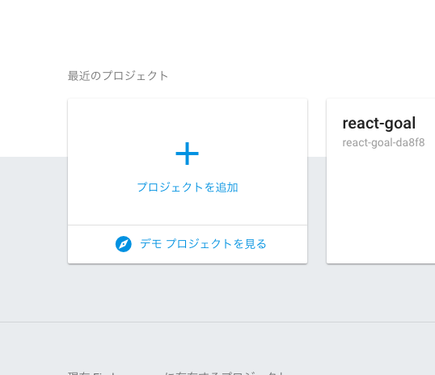
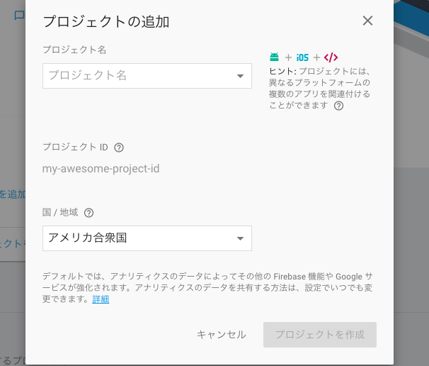
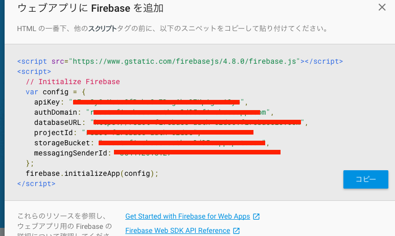
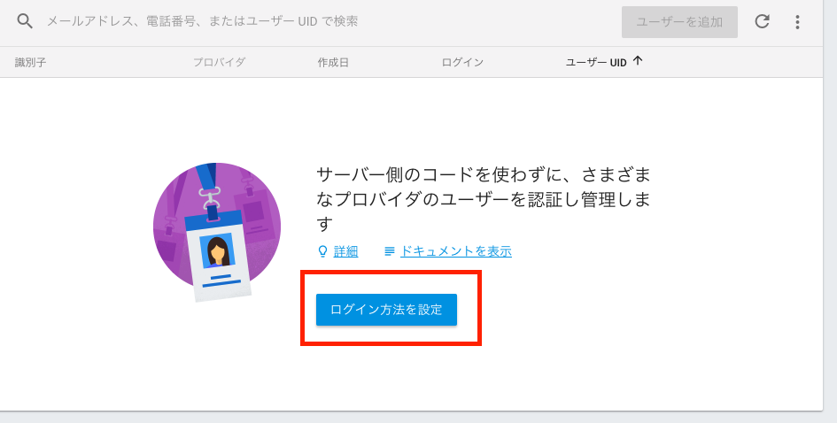
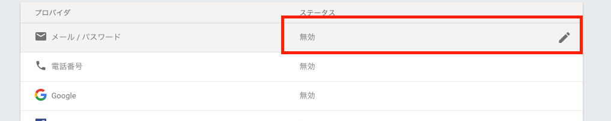

# react-firebase-todo
- `create-react-app xxxx`でファイルを作成（好きな場所にcdで移動して作成）
- 作成したreactプロジェクトにcdで移動して`npm-start`で起動
- PORTがバッティングする際は`package.json`を編集して、再度`npm i`
```js
"scripts": {
  "start": "PORT=xxx react-scripts start",

  //XXXに好きな番号を入れる、その後npm iで再起動しないと表示されないので注意
```

## 必要なnpmをインストール
- `npm install redux react-redux react-router firebase --save`を行う


## react-bootstrapを導入
- `public/index.html`の不要なファイルを<link>タグを挿入
- `https://react-bootstrap.github.io/getting-started.html`
- `<link rel="stylesheet" href="https://maxcdn.bootstrapcdn.com/bootstrap/latest/css/bootstrap.min.css">`


## srcフォルダ以下を削除
- 最初にインストールした状態だとsrcに色々なファイルがあるので一旦削除して新しく作成
- src/index.js
- コンパイルできないときはpackage.jsonを書き換えたことによる影響があるので`npm i`とかやる
```js
import React from 'react';
import ReactDOM from 'react-dom';

ReactDOM.render(
  <div>App</div>, document.getElementById('root')
)

//これでAppと表示されたらおk
```

## coponentsフォルダを作成
- src/components フォルダを作成
- App.jsx
- SignIn.jsx
- SignUp.jsx
```js
import React, { Component } from 'react';


class App extends Component {
  render() {
    return (
      <div>App</div>
    )
  }
}


export default App;

//これをコピーしてSignIn,SignUpに書き換える
```
- index.jsにインポートする
```jsx
//index.js

import React from 'react';
import ReactDOM from 'react-dom';
import App from './components/App';
import SignIn from './components/SignIn';
import SignUp from './components/SignUp';


ReactDOM.render(
  <div>App</div>, document.getElementById('root')
)

```

## React-Routerの導入
- 注意！バージョンが変更されているのでnpmでそのまま入れると古い場合は対応しない
- 今回の場合は`npm install react-router@3`で導入
```js
import React from 'react';
import ReactDOM from 'react-dom';
//import
import { Router, Route, browserHistory } from 'react-router';

import App from './components/App';
import SignIn from './components/SignIn';
import SignUp from './components/SignUp';


ReactDOM.render(
  //変更
  <Router path="/" history={browserHistory}>
    <Route path="/app" component={App} />
    <Route path="/signin" component={SignIn} />
    <Route path="/signup" component={SignUp} />
  </Router>
  , document.getElementById('root')
)

//これでlocalhost:3000/appとやって表示されたらok
```

## firebaseセッティング
- firebaseのサイトに行ってプロジェクトの作成

- 1各項目を入力していく



- 2各項目を入力していく



- 3　この場所をクリック


- 4　必要な情報をコピー



- src/firebase.jsを作成し先画像の箇所のコードをコピーして貼り付ける
```js
import * as firebase from 'firebase';

const config = {
    apiKey: "xxxxxxxxxxxxxxxx",
    authDomain: "xxxxxxxxxxxxxxxxx.com",
    databaseURL: "xxxxxxxxxxxxxxxx",
    projectId: "xxxxxxxxxxxxxxxx",
    storageBucket: "xxxxxxxxxxxxxxxx",
    messagingSenderId: "xxxxxxxxxxxxxxxx"
  };
//コードはセキュリティーのため一旦xで置き換え本来はここにおく
export const firebaseApp = firebase.initializeApp(config);

```
- index.jsにインポート
```js
import React from 'react';
import ReactDOM from 'react-dom';
import { Router, Route, browserHistory } from 'react-router';
import { firebaseApp } from './firebase';

import App from './components/App';
import SignIn from './components/SignIn';
import SignUp from './components/SignUp';

firebaseApp.auth().onAuthStateChanged(user => {
  if(user){
    console.log('user has signed in or up', user);
  } else {
    console.log('user has signed out or still needs to sign in.');
  }
})

ReactDOM.render(
  <Router path="/" history={browserHistory}>
    <Route path="/app" component={App} />
    <Route path="/signin" component={SignIn} />
    <Route path="/signup" component={SignUp} />
  </Router>
  , document.getElementById('root')
)
```

## SignUp/SignInコンポーネントの作成
- 各コンポーネントを作成していく
```js
//SignUp.jsx

import React, { Component } from 'react';
import { firebaseApp } from '../firebase';

class SignUp extends Component {
  //3 constructor　初期化してstateを準備
  constructor(props){
    super(props);
    this.state = {
      email: '',
      password: '',
      //8 エラー文章の表示設定
      error: {
        message: ''
      }
    }
  }

  //5 signUp関数を設定、最初はコンソールで値が取れているかチェック
  signUp() {
    console.log('this.state', this.state);
    const { email, password } = this.state;
    //6 firebaseとのつなぎこみ
    firebaseApp.auth().createUserWithEmailAndPassword(email, password)
      .catch(error => {
        console.log('error', error);
        //7 errorメッセージの追加
          this.setState({error})
      })
  }

  render() {
    return (
      //1.jsxでコーディングする
      <div className="form-inline">
        <h2>SignUp</h2>
        <div className="form-group">
          <input type="text"
            className="form-control"
            placeholder="email"
            //10 フォームのスタイルをインライン形式で設定
            style={{marginRight: '5px'}}
            // 2 onChangeイベントの設定 setStateで入力された値をthis.stateに代入
            onChange={event => this.setState({email: event.target.value})}/>

          <input type="password"
            className="form-control"
            placeholder="password"
            //10 フォームのスタイルをインライン形式で設定
            style={{marginRight: '5px'}}
            onChange={event => this.setState({password: event.target.value})}/>
          <button className="btn btn-primary"
            type="button"
            //4 onClickでsignUpの関数を走らせる
            onClick={() => this.signUp()}>
            Sign Up
          </button>
        </div>
        //9　エラー表示
        <div>{this.state.error.message}</div>
      </div>
    )
  }
}


export default SignUp;

```
- firebaseの設定でAuthenticationのメールログインを有効にする





- このセッティングをしないとfirebaseに情報が入ってこないので注意
- 設定ができるとフォームから入力された値がAuthenticationユーザーの中に登録されている

```js
//SignIn.jsx

//Sign upをコピーしてsigninに変更する
import React, { Component } from 'react';
//react-routerをインポート
import { Link } from 'react-router';
import { firebaseApp } from '../firebase';

class SignIn extends Component {
  constructor(props){
    super(props);
    this.state = {
      email: '',
      password: '',
      error: {
        message: ''
      }
    }
  }

  signIn() {
    console.log('this.state', this.state);
    const { email, password } = this.state;
    firebaseApp.auth().signInWithEmailAndPassword(email, password)
      .catch(error => {
        this.setState({error})
      })
  }

  render() {
    return (
      <div className="form-inline" style={{margin: '5%'}}>
        <h2>SignIn</h2>
        <div className="form-group">
          <input type="text"
            className="form-control"
            placeholder="email"
            style={{marginRight: '5px'}}
            onChange={event => this.setState({email: event.target.value})}/>

          <input type="password"
            className="form-control"
            placeholder="password"
            style={{marginRight: '5px'}}
            onChange={event => this.setState({password: event.target.value})}/>
          <button className="btn btn-primary"
            type="button"
            onClick={() => this.signIn()}>
            Sign In
          </button>
        </div>
        <div>{this.state.error.message}</div>
        //Link toでリンクをつける
        <div><Link to={'/signup'}>Sign up instaead</Link></div>
      </div>
    )
  }
}


export default SignIn;

```

## browserHistoryを設置
```js
import React from 'react';
import ReactDOM from 'react-dom';
import { Router, Route, browserHistory } from 'react-router';
import { firebaseApp } from './firebase';

import App from './components/App';
import SignIn from './components/SignIn';
import SignUp from './components/SignUp';

firebaseApp.auth().onAuthStateChanged(user => {
  if(user){
    console.log('onn', user);
    browserHistory.push('/app'); //追加することで　サインイン　したらappに飛ぶ
  } else {
    console.log('user has signed out or still needs to sign in.');
    browserHistory.replace('/signin');　//そうじゃなかったらsigninに飛ぶ
  }
})

ReactDOM.render(
  <Router path="/" history={browserHistory}>
    <Route path="/app" component={App} />
    <Route path="/signin" component={SignIn} />
    <Route path="/signup" component={SignUp} />
  </Router>
  , document.getElementById('root')
)

```
- browserHistoryを設定したのでAppを作り込む
```js
import React, { Component } from 'react';
//4　Signoutを走らせるためにfirebaseAppをインポートする
import { firebaseApp } from '../firebase';


class App extends Component {
  //3 signOut()関数を設定
  signOut(){
    firebaseApp.auth().signOut();
  }

  render() {
    return (
      //1ボタンとクリックイベントを設定
      <div>
      App
      <button
        className="btn btn-danger"
        //2 イベント設定
        onClick={() => this.signOut()}
        >
        signOut
      </button>
      </div>
    )
  }
}


export default App;
```

## Reduxの実装
- `constants.js`を作成
```js
export const SIGNED_IN = 'SIGNED_IN';

```

```js
//index.jsにインポート
import { createStore} from 'redux';
import { Provider } from 'react-redux';

//宣言しておく必要がある
const store = createStore();

//Providerでラップ
ReactDOM.render(
  <Provider store={store}>
    <Router path="/" history={browserHistory}>
      <Route path="/app" component={App} />
      <Route path="/signin" component={SignIn} />
      <Route path="/signup" component={SignUp} />
    </Router>
  </Provider>
  , document.getElementById('root')
)

```

- reducers/index.jsを作成
```js
import { SIGNED_IN } from '../constants';


let user = {
  email: ull
}


export default ( state = user, action) => {
  switch (action.type) {
    case SIGNED_IN:
      const{ email } = action;
      user = {
        email
      }
      return user;
    default:
        return state;
  }
}

```

- actions/index.jsを作成
```js
import { SIGNED_IN } from '../constants';

export function logUser(email) {
  const action = {
    type: SIGNED_IN,
    email
  }
}

```

```js
// index.js を編集
import React from 'react';
import ReactDOM from 'react-dom';
import { createStore} from 'redux';
import { Provider } from 'react-redux';

import { Router, Route, browserHistory } from 'react-router';
import { firebaseApp } from './firebase';
//action をインポート
import { logUser } from './actions';
//reducerをインポート
import reducer from './reducers';

import App from './components/App';
import SignIn from './components/SignIn';
import SignUp from './components/SignUp';

//reducerを引数に入れる
const store = createStore(reducer);

firebaseApp.auth().onAuthStateChanged(user => {
  if(user){
    const { email } = user;
    store.dispatch(logUser(email));
    browserHistory.push('/app');
  } else {
    console.log('user has signed out or still needs to sign in.');
    browserHistory.replace('/signin');
  }
})

ReactDOM.render(
  <Provider store={store}>
    <Router path="/" history={browserHistory}>
      <Route path="/app" component={App} />
      <Route path="/signin" component={SignIn} />
      <Route path="/signup" component={SignUp} />
    </Router>
  </Provider>
  , document.getElementById('root')
)

```

```js
//actions/index.js

import { SIGNED_IN } from '../constants';

export function logUser(email) {
  const action = {
    type: SIGNED_IN,
    email
  }
  return action;
}

```

- app.jxsを修正
```js
import React, { Component } from 'react';
import { connect } from 'react-redux';
import { firebaseApp } from '../firebase';


class App extends Component {
  signOut(){
    firebaseApp.auth().signOut();
  }

  render() {
    return (
      <div>App

      <button
        className="btn btn-danger"
        onClick={() => this.signOut()}
        >
        signOut
      </button>
      </div>
    )
  }
}

function mapStateToProps(state) {
  console.log('state', state);
  return {

  }
}

export default connect(mapStateToProps,null)(App);

```

## App.jsxを作り込む
- AddGoal
```js
import React, { Component } from 'react';

class AddGoal extends Component {
  constructor(props){
    super(props);
    this.state = {
      title: ''
    }
  }

  addGoal(){
    console.log('this.state', this.state);
  }

  render() {
    return(
      <div className="form-inline">
        <div className="form-group">
          <input type="text"
            placeholder="Add a goal"
            className="form-control"
            style={{marginRigh: '5px'}}
            onChange={ event => this.setState({title: event.target.value})}
            />
          <button className="btn btn-success" type="btn" onClick={() => this.addGoal()}>Submit</button>
        </div>
      </div>
    )
  }
}

export default AddGoal;

```

- App.jsxにインポート
```js
import AddGoal from './AddGoal';

//省略
return (
  <div>
    <h3>Goals</h3>
    //作成したコンッポーネントに置き換え
    <AddGoal />
    <div>Goal List</div>

  <button
    className="btn btn-danger"
    onClick={() => this.signOut()}
    >
    signOut
  </button>
  </div>
)


```

- firebase.jsに追加
- `export const goalRef = firebase.database().ref('goals');`


- AddGoal.jsxにインポート
```js
import React, { Component } from 'react';
//1 インポート
import { goalRef } from '../firebase';

class AddGoal extends Component {
  constructor(props){
    super(props);
    this.state = {
      title: ''
    }
  }

  addGoal(){
    console.log('this.state', this.state);
    //2 goalRefをプッシュsiteDBへ
    goalRef.push({email: 'test@gmail.com', title: this.state.title});
  }

  render() {
    return(
      <div className="form-inline">
        <div className="form-group">
          <input type="text"
            placeholder="Add a goal"
            className="form-control"
            style={{marginRigh: '5px'}}
            onChange={ event => this.setState({title: event.target.value})}
            />
          <button className="btn btn-success" type="btn" onClick={() => this.addGoal()}>Submit</button>
        </div>
      </div>
    )
  }
}

export default AddGoal;

//この段階でfirebase DBに格納される

```

- AddGoal.jsxを編集
```js
import React, { Component } from 'react';
import { connect } from 'react-redux';
import { goalRef } from '../firebase';

class AddGoal extends Component {
  constructor(props){
    super(props);
    this.state = {
      title: ''
    }
  }

  addGoal(){
    console.log('this', this);
    const { title } = this.state;
    const { email } = this.props;
    goalRef.push({email, title});
  }

  render() {
    return(
      <div className="form-inline">
        <div className="form-group">
          <input type="text"
            placeholder="Add a goal"
            className="form-control"
            style={{marginRigh: '5px'}}
            onChange={ event => this.setState({title: event.target.value})}
            />
          <button className="btn btn-success" type="btn" onClick={() => this.addGoal()}>Submit</button>
        </div>
      </div>
    )
  }
}

function mapStateToProps(state) {
  const { email } =state;
  return {
    email
  }
}

export default connect(mapStateToProps, null)(AddGoal);

```
